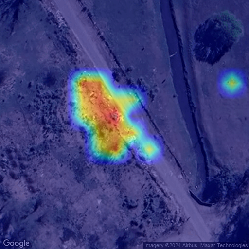

# Model for Waste Detection
This is a Docker + API setup designed for querying an image classification model trained on satellite imagery to detect waste dumps. This repository includes the module for downloading images from the Google Static Maps service, the query module, and the reconstruction of the response, which includes the original downloaded image and highlights the waste detection in the case of a positive classification.
The model was initially trained based on the [AerialWaste project](https://aerialwaste.org/). I also used public informatoin from [ACUMAR](https://www.acumar.gob.ar/) for query new samples as you could see in this documentation.

# API Documentation

## Overview

This API allows users to make predictions based on input images. It accepts image data and returns a prediction along with the processed image.

## Base URL

```
http://<your-server-address>:<port-number>
```

## Endpoints

### Predict

#### URL

```
POST /predict
```

#### Description

This endpoint accepts image data and returns a prediction along with the processed image.

#### Request Headers

- `Content-Type: application/json` or `Content-Type: application/x-www-form-urlencoded`

#### Request Parameters

- `latitude` (float, required): Latitude of the location.
- `longitude` (float, required): Longitude of the location.
- `zoom` (int, optional): Zoom level for the satellite image. Default is 18. Allowed values are [17, 18, 19].
- `quantile` (float, optional): Quantile for pixel thresholding. Default is 0.94. Allowed values are [0.90, 0.92, 0.94, 0.96, 0.98].

#### Example Request (JSON)

```json
{
  "latitude": -34.82929722222222,
  "longitude": -58.40813611111111,
  "zoom": 18,
  "quantile": 0.94
}
```

#### Example Request (Form Data)

```
latitude=-34.82929722222222&longitude=-58.40813611111111&zoom=18&quantile=0.94
```

#### Response

- **Status Code: 200 OK**

##### Example Success Response

```json
{
  "status": "success",
  "message": "Positive detection",
  "data": {
    "prediction": true,
    "score": 0.85,
    "output_image": "<base64-encoded-image>",
    "input_image": "<base64-encoded-image>",
    "location": {
        "latitude": -34.82929722222222,
        "longitude": -58.40813611111111,
    },
    "zoom": 18,
    "quantile": 0.94
  },
  "errors": null
}
```

- **Status Code: 400 Bad Request**

##### Example Error Response

```json
{
  "status": "error",
  "message": "Invalid input parameters",
  "errors": {
    "latitude": "Invalid latitude value",
    "longitude": "Invalid longitude value"
  },
  "data": null
}
```

- **Status Code: 500 Internal Server Error**

##### Example Error Response

```json
{
  "status": "error",
  "message": "Server encountered an error",
  "errors": null,
  "data": null
}
```

## Usage Example

### Using cURL

```bash
curl -X POST http://<your-server-address>:5000/predict \
    -H "Content-Type: application/json" \
    -d '{
          "latitude": -34.82929722222222,
          "longitude": -58.40813611111111,
          "zoom": 18,
          "quantile": 0.94
        }'
```

### Using Python `requests` Library

```python
import requests

url = "http://<your-server-address>:5000/predict"
data = {
    "latitude": -34.82929722222222,
    "longitude": -58.40813611111111,
    "zoom": 18,
    "quantile": 0.94
}

response = requests.post(url, json=data)
print(response.json())
```


## Examples:

#### We only send the lat and long. The rest of the arguments will be set by default.
curl -X POST -H "Content-Type: application/json" -d '{"latitude": -34.82929722222222, "longitude":-58.40813611111111}' http://localhost:5000/predict > output.txt

#### Read the output as image (you can also explore rest of the response)
```
import json
import base64
from PIL import Image
import io

def image_bytes_to_numpy(image_bytes: bytes) -> np.ndarray:
    image = Image.open(io.BytesIO(image_bytes))
    image = image.convert('RGB')
    image = np.array(image)
    return image

f = open('output.txt')
content = f.read()

cnt = json.loads(content)
img_bytes = base64.b64decode(cnt['data']['image'])
arr = image_bytes_to_numpy(img_bytes)
im = Image.fromarray(arr)
im.save('output.png') # Check the saved image.
```
")
*Downloaded Image for the given location.*


*Output Image with `quantile=0.94`.*

<!--

*Output Image with `quantile=0.98`.*
-->

## Developing
```
# Remove all dockers (just in case)
sudo docker rm -f $(sudo docker ps -a -q)

# Build it (check your Dockerfile to set the Cache option in case you need it).
sudo docker build -t waste-classifier .

# Quick development process: update your code and verify it on the fly:
docker run -it --rm -v $(pwd):/app -p 5000:5000 waste-classifier

# Just run it
docker run -p 5000:5000 waste-classifier
```
